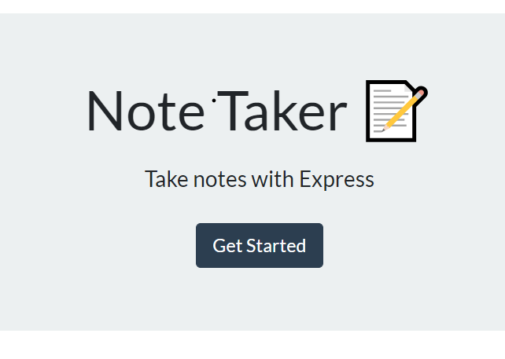
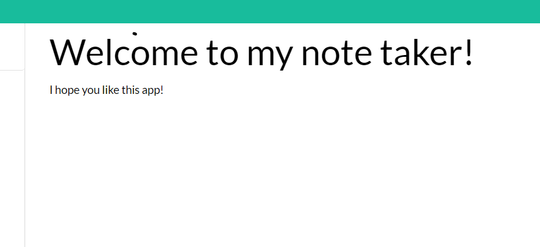
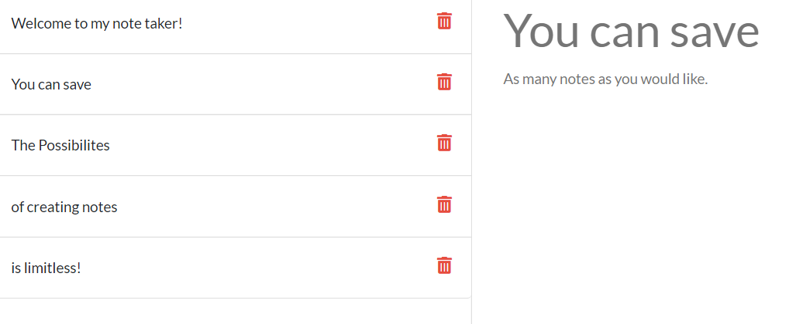

# A Useful Note Taker

  

   
  
  This project is designed to help a student, worker or anyone who just needs to take notes, be able to write, save, review and delete any information they would like to make.  

   

## Table of Contents

~[Installation](#installation)
~[Usage](#usage)
~[Contributing](#contributing)
~[Features](#features)
~[Tests](#tests)
~[License](#license)
~[Questions](#questions)

   

## Installation

  

  
  **To edit/use the application, please follow the steps to pull the repository from GitHub through Git Bash and pull the script into VSCode, provided all three items are already installed on a local network.  It also requires Node.JS to be installed on the local network as well.**

Instillation steps are as follows:

1. Access the repository at [Git Hub] https://github.com/Napica/HW-09-A-Note-Taker.
2. Click on the code section (in green) and clone the SSH key.
3. Once the SSH key is cloned, open the terminal through Git Bash.
4. Find or create the folder the user wants to work in and enter the following commands the the Git terminal:
   1. git clone [copied link] (_this will allow access the repository to the local computer._)
   2. git pull (_this will pull all the lines of script from the local repository._)
   3. code . (*This will extract the code and link the paths to VSCode for review/editing/uploading*)
5. In the the terminal, please run "npm install" (as the dependencie should be there) to download the modules necessary for this project to work.  
6.  Once the modules are downloaded, please open up the terminal again and run "npm start".  This will initialize the project and send you on your way to generating the localhost. 

Please click on the link below to see a live deployed version of the project:

1. https://secure-savannah-70424.herokuapp.com/

   
   
  
  ## Usage 
  
  

  
   
  
 This project is used to create, review, delete notes.  
     
     

  ## Contribution 
  
  

  
  #### Contributors 
  
 I would like to thank Jonathan Canales, Alex Flemming and Peter Colella for the advice and guidance in creating this project. 
  
   
  
  ## Features
  

  
#### To get started writing notes:
  
 

 

#### The user can add a title of the note and the body of the note in the browser.  

 

 

#### To create a new note, the user must click the pencil icon and to save a note, the user must click on the file icon. 

 

#### The user can generate, save, and cylce between as many notes as they would like 

 

## Tests

  

  
  
  If you would like to go about testing this project, please install the project on a local server for testing.   

   
  
  ## License 
  
  

  
  This application is licensed under MIT

   

## Questions

  

  
  #### If you would like to know more, please contact or see any other projects at [napica](https://github.com/napica)